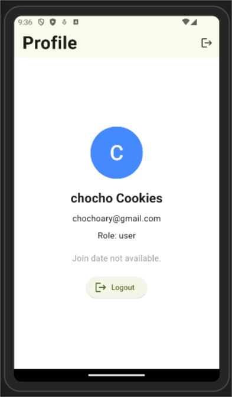
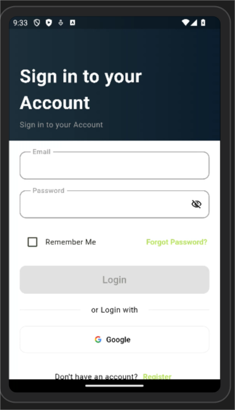

# Login App

A simple Flutter application with Firebase integration for authentication features.

## Features

- **User Login**: Login with a username and password.
- **Registration**: Register using an email address.
- **Google Login**: Authenticate users via Google Sign-In.
- **Forgot Password**: Reset forgotten passwords via email.
- **Email Verification**: Verify user email addresses through Firebase.
- **Password Validation**: Ensure strong and unique passwords by enforcing length and complexity.

## Getting Started

This project serves as a starting point for building Flutter applications with Firebase integration.

### Prerequisites

1. Install Flutter SDK: [Flutter Installation Guide](https://flutter.dev/docs/get-started/install)
2. Set up Firebase project: [Firebase Console](https://console.firebase.google.com/)
3. Add your Android app to Firebase: [Firebase Setup Guide](https://firebase.google.com/docs/android/setup)

### Installation Steps

1. Clone the repository:
   ```bash
   git clone https://github.com/chochocookies/simple-login-app
   cd login_app
   ```

2. Install dependencies:
   ```bash
   flutter pub get
   ```

3. Configure Firebase:
   - Download `google-services.json` from your Firebase project.
   - Place the file in the `android/app` directory.

4. Run the application:
   ```bash
   flutter run
   ```

---

# Aplikasi Login

Aplikasi Flutter sederhana dengan integrasi Firebase untuk fitur autentikasi.

## Fitur

- **Login Pengguna**: Login menggunakan nama pengguna dan kata sandi.
- **Registrasi**: Daftar menggunakan alamat email.
- **Login Google**: Autentikasi pengguna melalui Google Sign-In.
- **Lupa Kata Sandi**: Atur ulang kata sandi yang terlupa melalui email.
- **Verifikasi Email**: Verifikasi alamat email pengguna melalui Firebase.
- **Validasi Kata Sandi**: Memastikan kata sandi yang kuat dan unik dengan menerapkan panjang dan kompleksitas tertentu.

## Memulai

Proyek ini merupakan titik awal untuk membangun aplikasi Flutter dengan integrasi Firebase.

### Prasyarat

1. Instal Flutter SDK: [Panduan Instalasi Flutter](https://flutter.dev/docs/get-started/install)
2. Siapkan proyek Firebase: [Konsol Firebase](https://console.firebase.google.com/)
3. Tambahkan aplikasi Android Anda ke Firebase: [Panduan Penyiapan Firebase](https://firebase.google.com/docs/android/setup)

### Langkah Instalasi

1. Kloning repositori:
   ```bash
   git clone https://github.com/chochocookies/simple-login-app
   cd login_app
   ```

2. Instal dependensi:
   ```bash
   flutter pub get
   ```

3. Konfigurasi Firebase:
   - Unduh `google-services.json` dari proyek Firebase Anda.
   - Tempatkan file tersebut di direktori `android/app`.

4. Jalankan aplikasi:
   ```bash
   flutter run
   ```


## Project Preview

Below is a visual preview of the Login App project:

 

